# Transactor Performance: Theory & Practice

* **Speaker: Joe Lane**
* **Conference: [Clojure/Conj 2024](https://2024.clojure-conj.org/)**
* **Date: 24 October 2024**
* **Video: [https://www.youtube.com/watch?v=k7i4AEiWLW0](https://www.youtube.com/watch?v=k7i4AEiWLW0)**

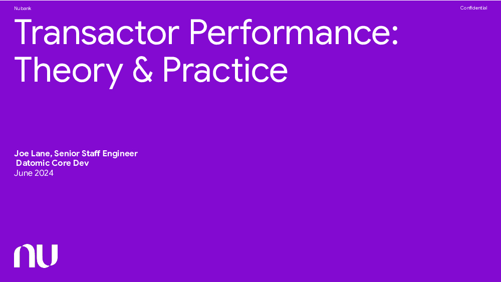

Good morning everyone. I'm so happy that we're all here. Let's kick it off. So, hi, I'm Joe Lane. I'm here to talk about transactor performance theory and practice. I work on Datomic Core Dev and I'm proud to say that I enjoy working at Nubank where we're reducing complexity in the lives of over a hundred million people. I think that's pretty cool.

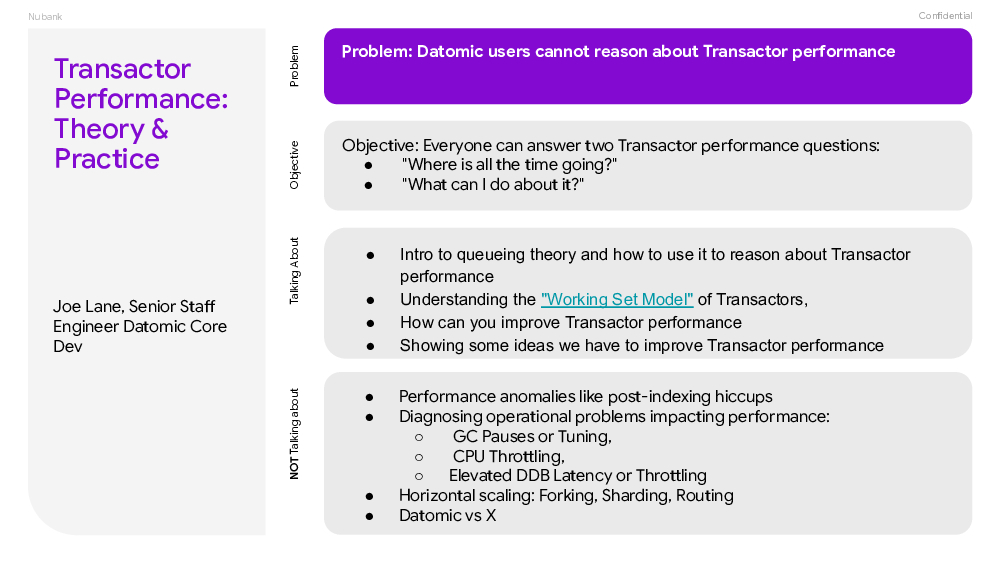

So with that, here's our agenda. So as you know, we're the Datomic team; we fixate on problems. So the problem is that Datomic users can't reason about transactor performance and our objective today is that everyone should be able to leave being able to answer two questions: 

where is all the time going, and
what can I do about it?

So what we're going to touch on is a quick refresher of the Datomic architecture, a brief intro to queuing theory, understanding something known as the working set model, then we're going to switch gears into how you can improve your transactor performance and some recent improvements that we've made that we'd like to talk about.

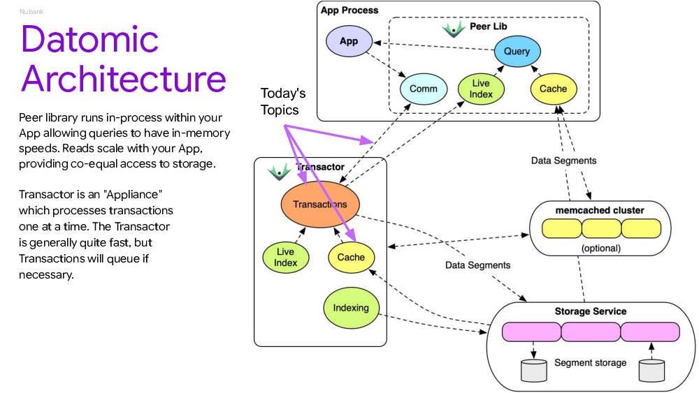

So Datomic's architecture at a super high level. With Datomic, we have something called a Peer. The Peer library runs in-process with your app – so this is inside of your web server or inside of your batch process, whatever – but it's in-process in your JVM, collocated with your code. That means that queries have in-memory speeds and reads can scale with your app providing co-equal access to storage. That's why they're called Peers: you do not need to go coordinate through some centralized system in order to perform your query.

We then have another component called the Transactor. And the Transactor is an appliance which processes transactions safely, one at a time. And it's generally quite fast, but sometimes, given enough load, transactions will queue. This is the subject of today's conversation.

[missing slide: transaction lifecycle]

So let's dig in a little bit into the life of a transaction itself. So in detail, in your Peer, you will submit a transaction from your app saying, "Sally likes pizza now," whatever. And that data will be sent over a wire and it will arrive at a queue in the Transactor. This queue then is pulled – or data is pulled off this queue – by this component (we're just going to call it the transaction processor right now).

Reads are performed to something called an object cache, which is an in-memory cache where there are datoms packed into segments, which is an array of datoms. These segments, if they're not in memory, get pulled from external caches or external storage. And inside the transaction processor, historically we have discovered what segments we need one miss at a time out of the object cache. Once the transaction completes, we then commit that data into the storage service and then emit the transaction results out to this thing called a notify queue, and then that's broadcast back to the Peers.

That's it. We can move on. Any questions? No? All right. So let's dig in a little bit into queuing theory.

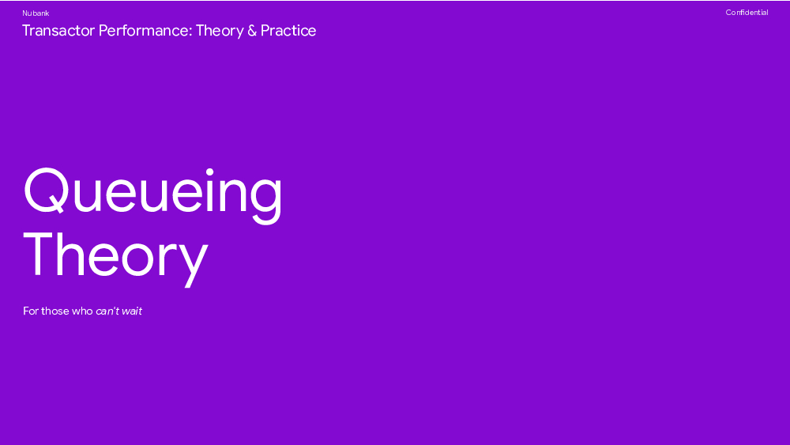

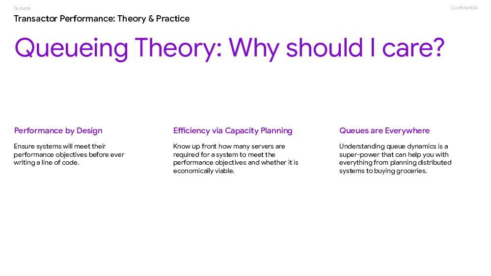

So why do you care? Why would you care about queuing theory at all? One reason is that you're trying to ensure _performance by design_. So you want to make sure that your system will meet the performance objectives before you ever actually write a line of code. You want to know if you're going to fail early so you can do something else.

Another reason is that you want to ensure that your system is economically viable and efficient from a capacity planning perspective. You also may want to know how many nodes do you need in order to hit your performance objective – do you need shards right off the bat, etc., etc. And lastly, queues are pretty much everywhere. You'll see them everywhere from grocery stores to distributed systems and pretty much everything in between. Once you see it, you can't unsee it. So, I'm sorry.

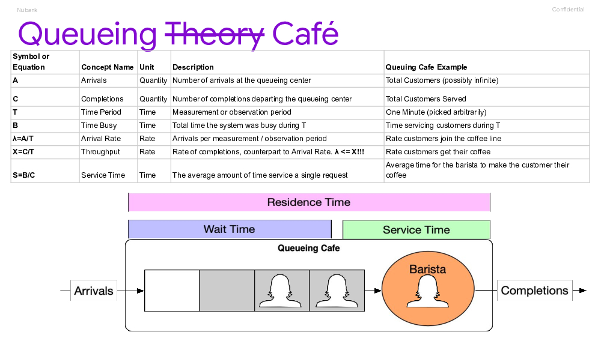

All right, so this is a little dry, so I'm going to try to make it light. We're going to run through a couple of symbols and work through it with an analogy. First, we're going to talk about *arrivals*. So arrivals are the total number of customers – which is possibly infinite – that will ever enter your Queuing Cafe. Right? (You are now the owner of a cafe.)

*Completions* (`C`): these are the total number of customers served. `T` is an *observation period*; so this is a measurement period that we picked arbitrarily as 1 minute just to make the math easy. `B` is the *busy time* that you spent servicing customers during the measurement period `T`.

Lambda (`λ`) here is the next one; this is the *arrival rate*. So this is the rate that customers are joining your line at your cafe. *Throughput* is the rate that customers get their coffee, and this must be greater than or at least equal to the Lambda, otherwise you're going to have a bad time.

And lastly, we've got *service time*. So service time is the average time for the barista to make customers their coffee – one coffee. So looking at these colors, we've got *residence time*, which we'll talk about in a second, that is encompassing of both service time and *wait time*. Service time is just the time you spent waiting at the head of the line, and wait time is the time you spent behind everyone else.

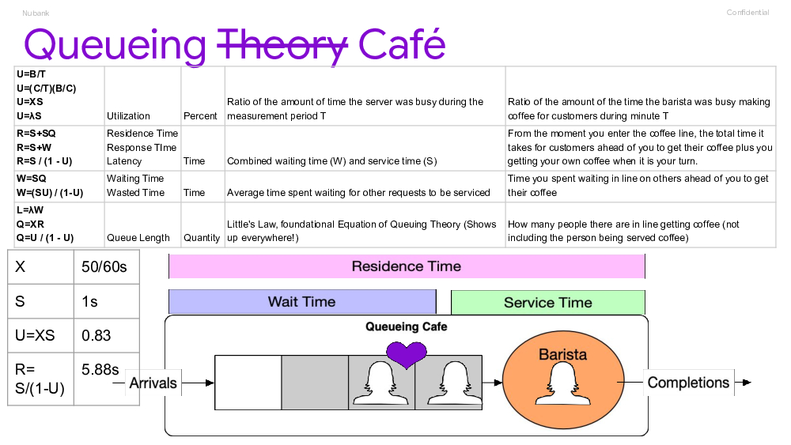

So now we're going to get to some interesting stuff. So *utilization* is the ratio of time the barista was busy in that minute making coffees for customers. Next, we have *residence time* or ’response time’ as most people know it, which is from the moment you enter the coffee line, the total time it takes for customers ahead of you to get their coffee plus you getting your own coffee.

We then have waiting time, which is sort of wasted time, which is the same as residence time minus the time it took for you to get your coffee – so just the time you spent waiting for other people. And lastly, we have Little's Law, this is *queue length*. This is how many people are there in line getting coffee, not including the person at the head of the queue.

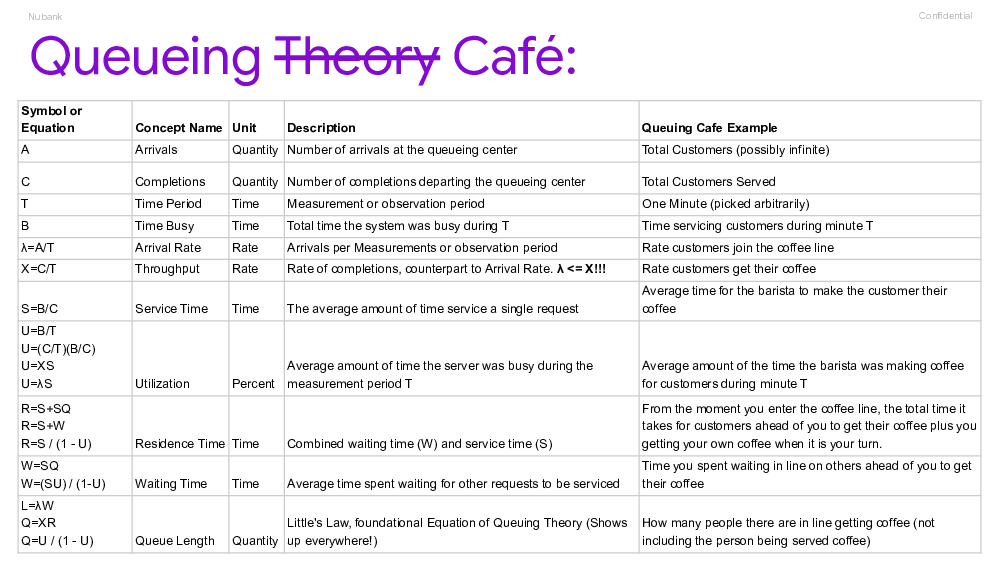

I will say, not all time is wasted when you're waiting in a queue; maybe two people arrive at the same time, they fall in love, it's a beautiful story. It could happen. So this is just a reference table; I don't expect anybody to actually soak this in right now but you can look at it later if you wanted to play with these or put them in a spreadsheet.

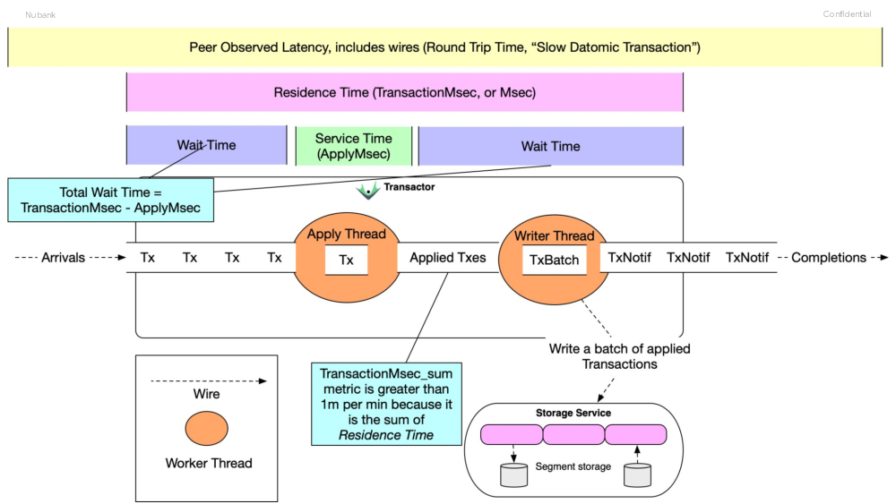

So here's how we would see this inside of the transactor. Peers are this yellow block up at the top and their total time span is roundtrip time including wires, and the transactor has no metric for this because it can't know how slow your wires are.

Inside of the transactor we have something called `TransactionMSec` or `Msec` in the logs, and this is the residence time. So it's the total time from the moment that a transaction enters the transactor to the time that it leaves to notify the peers. Then inside of this, we have this little green box and this is called the `ApplyMSec`. This is the service time from our previous slide; that's the time it took to apply just one transaction.

So if we look inside this transactor now, we've got the arrivals coming in from the peers, they go into a transaction queue, then there's this `Apply Thread` which is the transaction processor in a nutshell. We then emit those results out to another queue and then we have another thread which batches these up, does a write to storage, and then we enqueue the results onto a notification queue.

Because of this, it means that the `TransactionMSec` sum metric is actually greater than one minute in highly utilized systems because the time spent waiting for a given transaction overlaps because of the batching. This is fine.

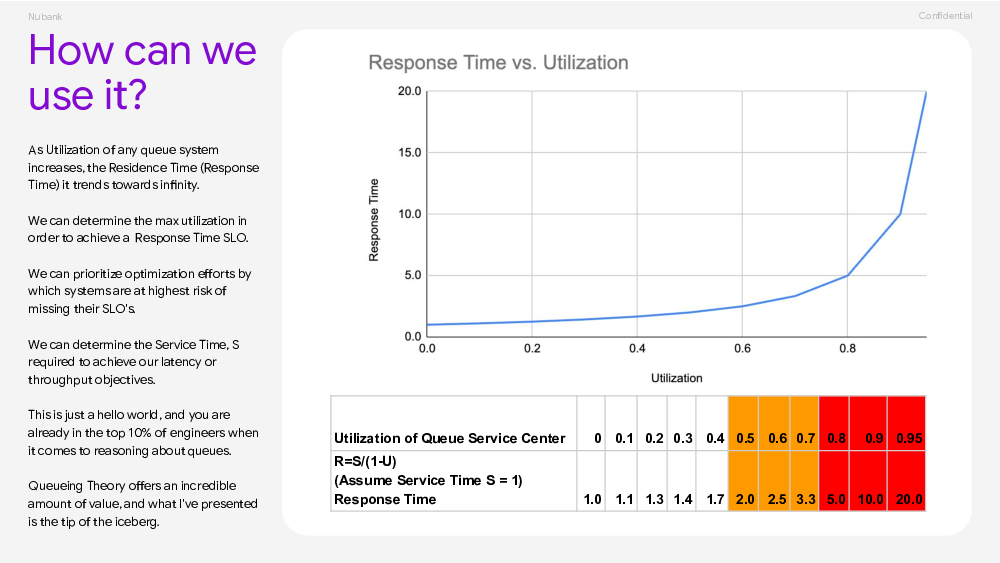

So how can we use this? Well, as the utilization of any queuing system increases, the residence time trends toward infinity. This is bad. We can determine the max utilization in order to achieve a response time that we could tolerate. So if we have an SLO of 50 milliseconds, we can figure out what is the maximum utilization our systems could ever be at if we want to hit that target.

We can use this to prioritize optimization efforts and figure out where should we focus our time to get the best bang for our buck. This brief little introduction here is the tip of the iceberg, but already, just understanding some of these dynamics is extremely powerful and it puts you in sort of the top 10% of engineers in understanding queuing theory. Not that this was a great introduction, but there's a huge depth of knowledge here that you could glean.

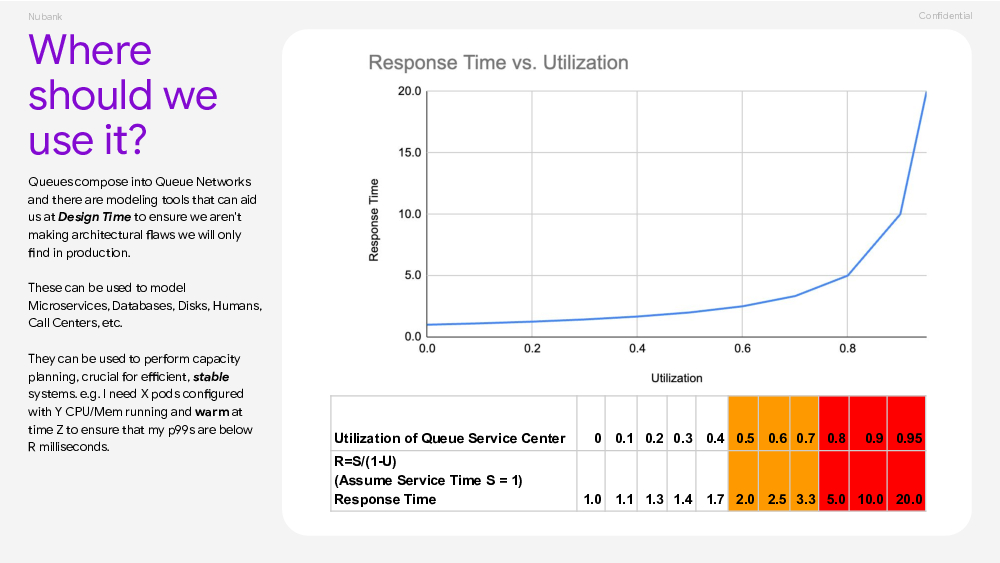

So where should we use it? Well, you can actually put queues into little networks, and there are modeling tools that can help us at design time—again, to help us try to ensure that we're not making architectural flaws and design mistakes that we would only later find out in the most expensive place to find them, which is production.

You can use this to model microservices that talk to each other. You can use it for databases, modeling disks, figuring out how many disks you need, how many employees you need, call centers, etc., etc. And it's really nice for capacity planning to figure out how much hardware and how many resources do you need in order to ensure a stable system. I don't think I need to get into that – people understand the value of stability – but stable systems are fast systems.

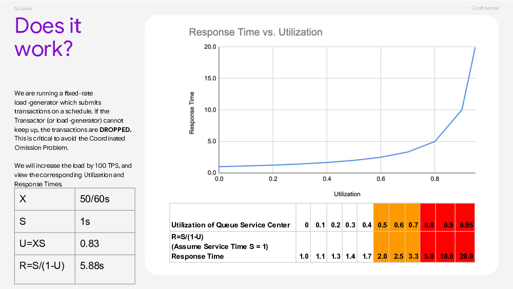

Does it actually work well? So let's look at this little chart. This response time versus latency chart here is normalized. So at 0% utilization, the response time is one. At 50% utilization, we have a response time of two, and at 80% utilization, we've got a response time of five-ish seconds.

Well, if we look at this worked example up on the top left, if you have an arrival rate of 50 arrivals per minute and you have a service time of 1 second per minute, your utilization is 83% and your response time is going to be 5.8 seconds. If I look at the 
little table here, I think that pans out.

But let's see a real example of this. So here we're running a fixed rate load generator which submits transactions on a schedule. If the transactor or the load generator cannot keep up, transactions actually get dropped. This is critical for preventing the coordinated omission problem, which is a classic problem with load generators and load testing analysis.

So looking at this, we can see that as the load increases in steps of 100 transactions per second – which is the green axis, it’s the right y-axis – as we increase the load in steps of 100 transactions per second, the orange is the corresponding utilization which is the left y-axis. This is great, what about response times? 

Well, this is the peer observed response time and, surprise, the math checks out.

’How can we affect utilization then’ is the big question. So in an open queuing system like microservices architecture, you have no control over the arrival rate from the perspective of that system. The only thing we can do is control `S`, which is the service time to perform these transactions. So this really leads us to the big question of: what happens during `S`?

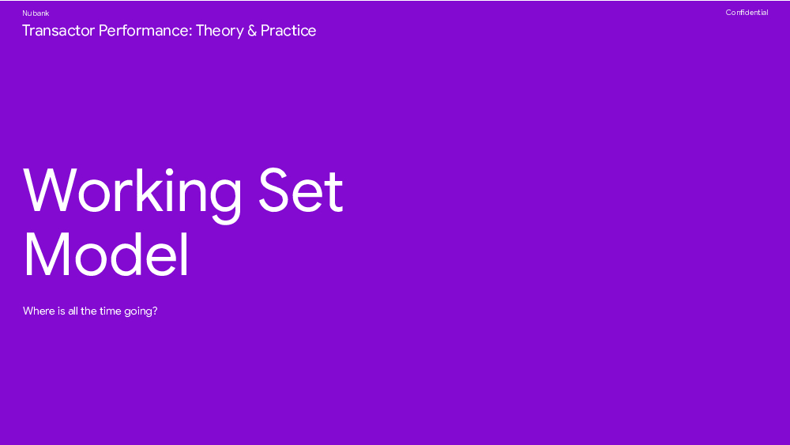

So, the working set model. Where's the time going? 

[missing slide: working set model paper]

The working set model actually comes from this paper out of MIT from 1968. Something about everything good was in the '70s, whatever.

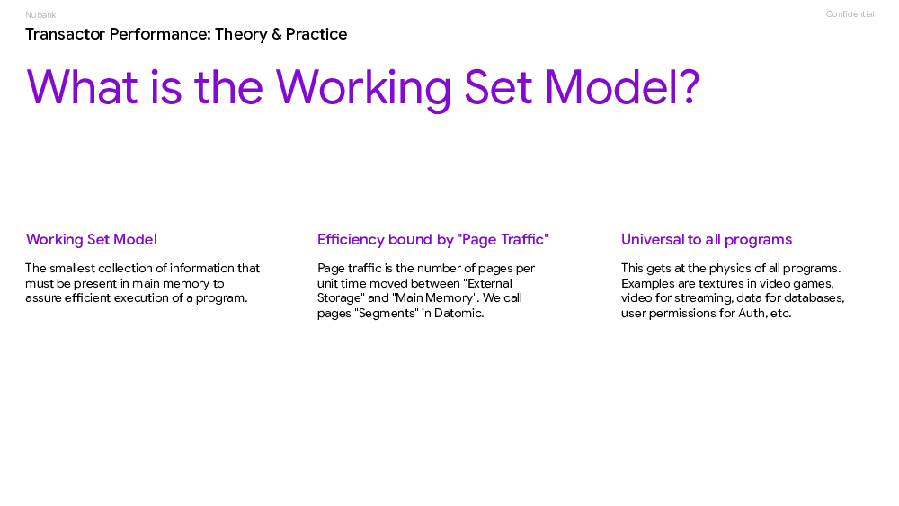

So what is the working set model? The working set model is effectively the smallest collection of information that must be present in main memory to ensure efficient execution of your program. Efficiency here is bound by the *page traffic*. Page traffic is the number of blocks – pages, segments, data – per unit time moved between external storage and main memory. We call pages "segments" in Datomic because that's the unit that we're operating at, but this is a pretty universal concept to most programs that touch data. It's the same thing with textures in video games, videos for streaming data for databases, user permissions for authentication, etc, you could come up with any sort of example you want. The efficiency is bound by ’how long does it take for me to get the data so I can do work on it?’

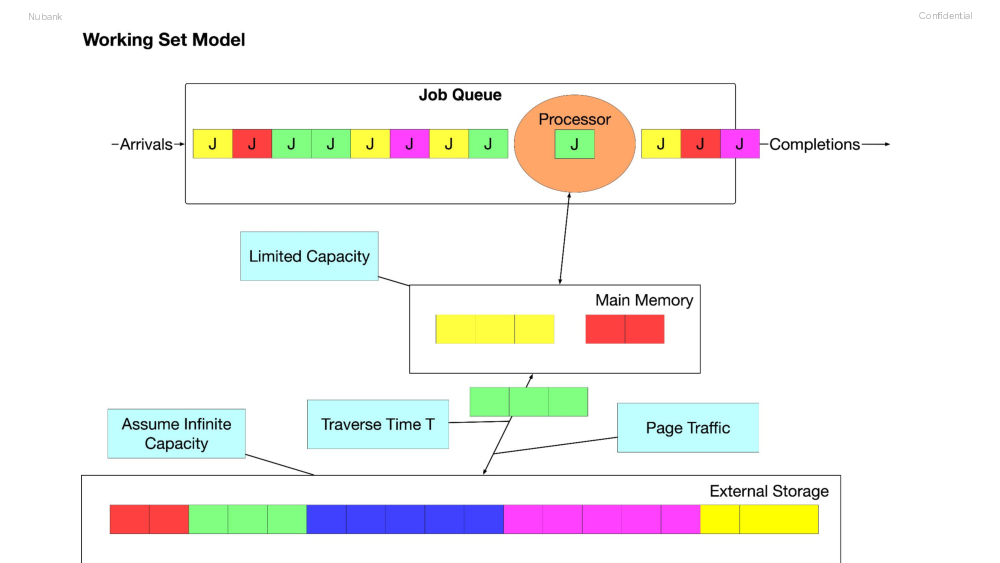

So this is a diagram of the working set model. We can think of a job queue similar to what we saw previously, where there's some worker called the Processor here and it takes jobs off a queue and runs those jobs.

Then we have Main Memory, which is an LRU cache. And we can see in main memory we have got red segments and yellow segments because we just finished a red job and a yellow job. And if we look then at what's in between external storage and main memory, we can see that we are in the process of a *data stall* where we are waiting to fetch the data from external storage into main memory to then begin doing work on it in the processor.

So main memory is limited capacity. For this model, we can assume infinite capacity for external storage. We would want to measure the *traversal time* between external and main memory, and you can measure bandwidth as the page traffic. These are sort of different measurements, but they're very well spelled out in that paper and I encourage you to go read it. Originally that paper is about CPU architecture from the late '60s.

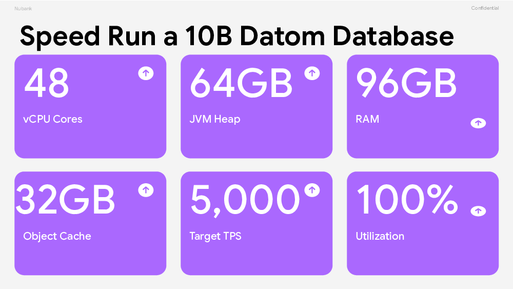

Let's shift gears a little bit and speedrun a 10 billion datom database. So these are some of the hardware specs on it. We're going to flood this system with 5,000 TPS and it's going to be completely saturated. Remember, the load generator drops transactions when it can't keep up because they're scheduled. So this is just a way for us to ensure that we're absolutely saturating this system. 

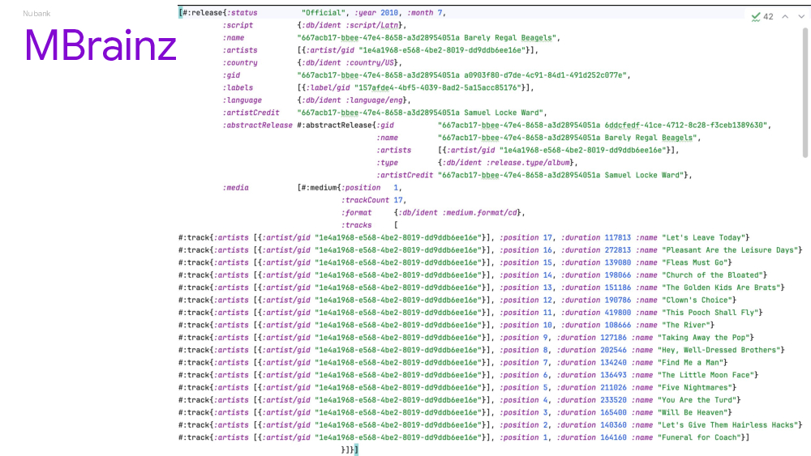

And just to make sure that everyone knows this isn't an arbitrary synthetic benchmark, this is some nasty MBrainz data that does not have a very performant schema for doing transactions, for doing writes. This is what one transaction looks like in this scenario. It's quite big. We're submitting releases which have many mediums which have many tracks, so we're birthing a bunch of entities, we're doing a bunch of uniqueness checks, etc., etc. We'll dig into more of that later.

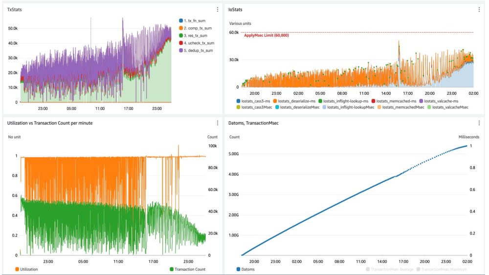

So this is 0 to 5 billion datoms. So the first thing I want to focus in on is the top left panel. And maybe you could read that – you don't necessarily have to – all you need to understand is that on the top left we have a measurement called `TxStats`. `TxStats` is a measure of, semantically, what are we doing when we are processing that transaction? And we are summing these per minute and stacking them. So this green on the top left panel is the time spent resolving entities. We'll dig into what the `TxStats` are in the next slide. But the way you would look at this top left panel is as a stacked chart of time spent doing something semantic inside the transaction.

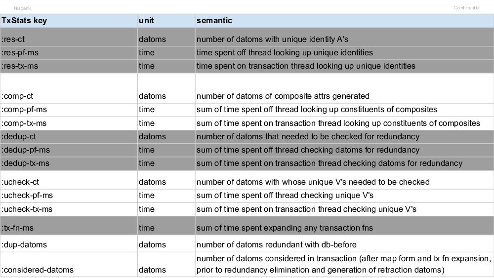

These are some of the `TxStats` keys, and I've highlighted the ones that we've got graphed in green. `TxStats`, the way that we're using it here, we're just looking at the time of five different semantic operations.

So, `:res-tx-ms`: this is the time spent on thread actually looking up unique identities – so resolving an existing entity. `:comp-tx-ms` is the time spent processing composite tuples, which we have none. `:dedupe-tx-ms`: this is how much time was spent in the transactor looking for redundant datoms to de-duplicate. So let's say, for example, you were upserting some entity and you resubmitted all the attributes for that entity except for one; you would spend time de-duplicating the redundant ones out of that map to then only submit or actually assert the novel fact. And this takes time. Don't do that.

So we have uniqueness checks [`:ucheck-tx-ms`], which is different than `:res-tx-ms`. This is actually the time spent asserting that a value is unique. And then `:tx-fn-ms`: this is time spent doing transaction functions including CAS. It's all wrapped up into one metric today. 

So with that, yeah, the green up on the top left is just time spent resolving entity identities.

Next, on the top right, we have `IoStats`, which is a similar stacked time chart. And you can see at the beginning of this database, for the most part, the only thing we've got is orange, and this is time spent de-serializing datoms – which we've got measurements for now. And we'll look at the `IoStats` keys in just a second.

But it is time stacked, and then there's this horizontal line that says `ApplyMSec Limit`. So this is like 60 seconds per minute; there's no more work you could do in that period of time in a single thread. Right?

[missing slide: IOStats keys]

So the `IoStats` keys – I don't think I need to attach the semantic here because they're just timings – but we have storage on the bottom: so Cassandra, Dynamo, SQL, etc., dash `ms`: this is time spent reading from storage. Then we've got `memcached-ms`: time spent reading from memcached, etc., etc., all the way up. Valcache, de-serialization time, and then time spent in something called the inflight lookup. I'm not going to get into that yet, but I will soon.

So then these bottom two charts are a little bit different. They're not stacked. They've got a left and a right y-axis, but you've seen the one on the bottom left before. So utilization is on the left and the count of transactions per minute is on the right.

The chart on the bottom right is how many datoms are in this system. So as the database grows in size, eventually the transaction count per minute that we can process degrades because, as we can see in the top right panel, the amount of IO that we need to do per transaction increases to about 30 seconds per minute. And if we wanted to know what can we do about it, we would look at the `TxStats` chart and we can see, well, most of the time is spent resolving transaction identities in green, so we should focus our optimization efforts there.

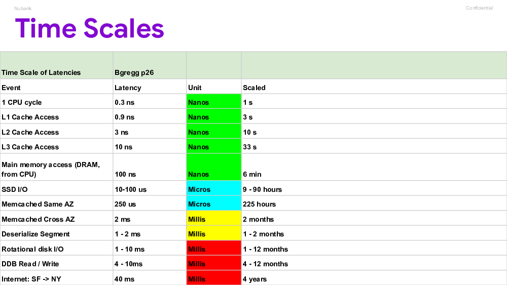

I'm going to quickly look at some time scales to remind everybody about just how fast nanos, millis,  micros are. So this is taken right out of page 26 of System Performance, and it's scaled to 1 second.

So one CPU cycle is 1 second. L1, L2, L3 is lightning fast. Main memory jumps from 33 seconds at the L3 cache in a CPU all the way up to six minutes, which is a lot, but not nearly as much as going outside of main memory. Even to an NVMe SSD, it's 10 microseconds, which is 9 to 90 hours as opposed to six minutes, and it just gets catastrophically worse from there.

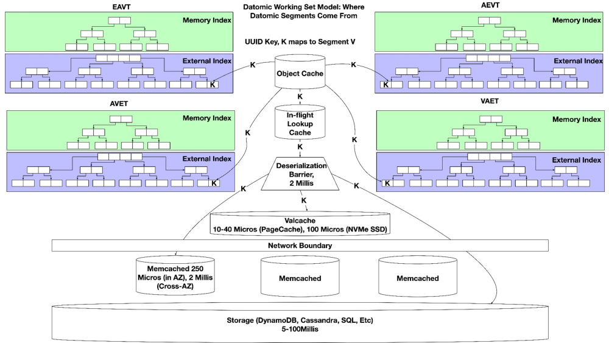

So why am I showing you this? Well, I want to briefly show the caching tower inside of Datomic and when we go grab segments.

In Datomic we've got four different indexes, and those indexes are broken out into in-memory components and external indexes. The in-memory components are an in-memory B-tree, and the external indexes get held inside of something called the object cache. So not all of the database needs to fit into memory at one time; that would be a disaster.

So what we do instead is we have these pages that we referred to earlier, which are little thousand-datom chunks which we store in different caching tiers. In order to actually perform a de-duplication or perform a uniqueness check, we have to go look: do we already have this datom or not?

And so what we need is to have that datom in a segment de-serialized in the object cache before we can answer that question. Well, we then have to go get it from somewhere if we missed. So where would we get it from? Well, we can look in the in-flight lookup; this is maybe some other thread is already trying to do this request and I don't have to do it again, I can just wait for the first one to finish.

Next, we've got sort of a memory barrier here; this is the amount of time it takes to do a de-serialization. It's somewhere between 500 micros and 2 milliseconds, but we're working on improving that so this may eventually go away, which would be great. Then we've got a valcache, which is an NVMe SSD that's on the instance – so not over fiber, actually attached on the same PCI bus. This is 10 to 40 micros if the segment is in the page cache and it's about 100 micros if it's on disk but not in the page cache, which is light years faster than a network hop, especially across availability zones. And, you know, we might as well go to the Andromeda galaxy if we're going to storage, if we're scaling these numbers appropriately.

So with that, I think it's maybe clear that we spend time on IO for the working set model as the database working set falls out of main memory. It's like physics – as something gets bigger, it doesn't fit.

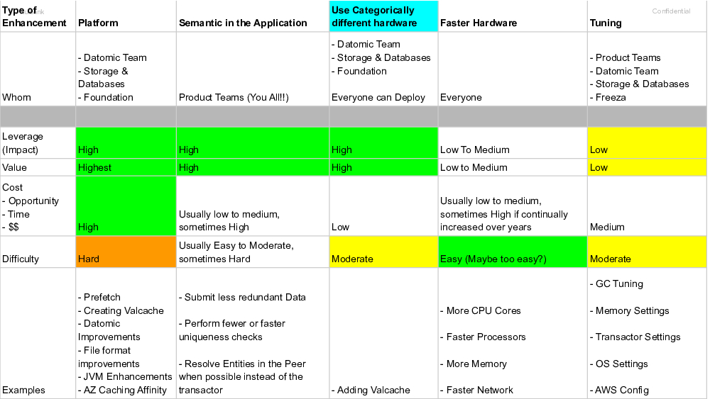

So onto the next section: what can you do about it? How can you improve transactor performance? So here we've got an optimization leverage table. You can read it right to left in increasing amounts of leverage.

So if you wanted to improve transactor performance, you could fiddle with some knobs. Cool. Sometimes you need to do that, it can be a quick win, but it requires a lot of expertise to get it right, and often times you don't have that expertise right off the bat.

Next, you could deploy faster hardware. I heard that CPUs are not getting faster, but maybe you've got one, I don't know. 

The next one is using categorically different hardware. So the example that we're going to use is adding a valcache. So this is like adding a new component. Adding a Valcache means adding an NVMe SSD and then running Valcache on it. 

The last two are semantic improvements in the application and platform level improvements, and we'll touch on those in a second.

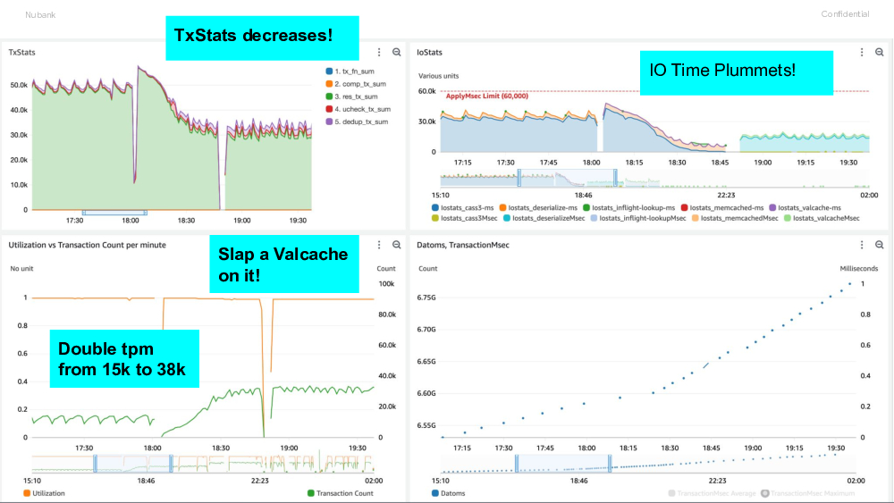

So in my speedrun, this is the difference when we add a Valcache. That's all we did. Otherwise, it had just been reading from storage and we can see immediately that the `TxStats` decrease, our transactions per minute doubled up from 15,000 to 34 or 38,000, the IO time plummets on the top right, and if you look in the bottom right you can see that our growth rate sort of hockey-sticks up, which is nice. That's the goal, right?

Always a much more powerful thing you can do is semantic improvements in your application. So this is submitting less redundant data, performing fewer uniqueness checks, or resolving entities in a scalable place like the Peer so that the transactor doesn't have to do it.

How exactly can you do this? So one way to do it is using sequential identifiers instead of uniform random identifiers for uniqueness checks. This has a dramatic speedup and we'll take a peek at this in a few slides.

But you can also at schema design time work to intentionally model your schema and your access patterns around this if you know you have to do capacity planning to hit your performance numbers. And you can often limit the working set size to one or a few small number of entities which fit inside your object cache at all times.

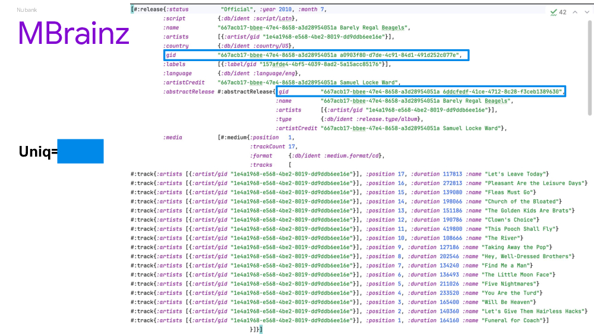

So how would we do this in this gnarly transaction data? Well, right here I know that these are the only two entities that are being resolved per transaction and so simply changing these to become sequential identifiers – we call them Squuids, you may know them as UUID v7s, they're Squuids before sevens came out – and simply doing that we can actually reduce the size of the object cache down to one gigabyte and we dramatically reduce our IO time. 

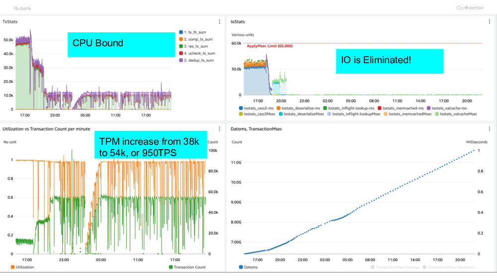

We now become effectively CPU bound. Our transactions per minute jump from 38 to 54,000 per minute, or 950 transactions per second. This is not a limit, this is not some fundamental bottleneck, but with this schema and this large database, this is the number that we arrived at. And we can see on the bottom right panel that in one more day we end up hitting 11 billion datoms with another hockey-stick-like improvement to our growth rate.

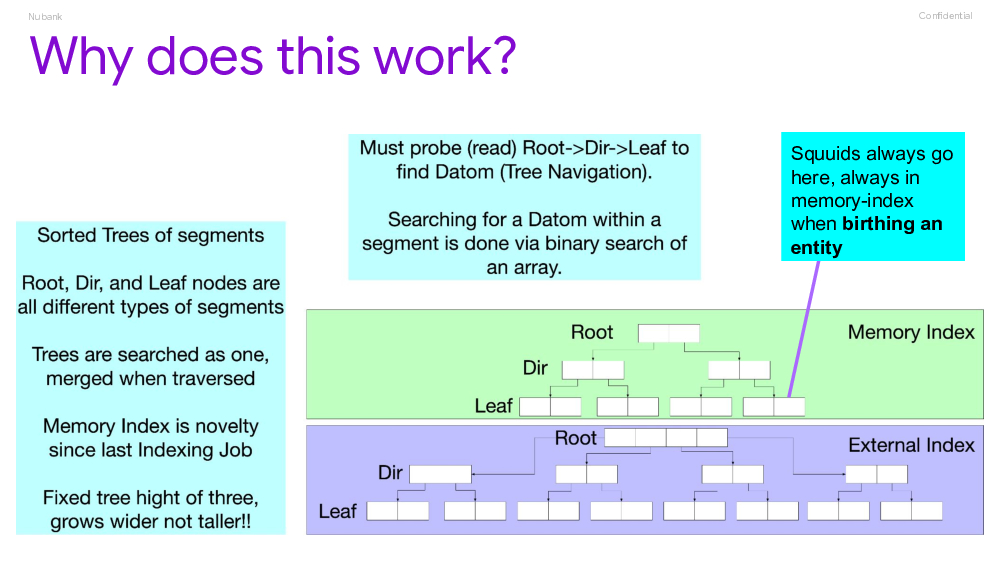

So why do sequential identifiers actually work this way? So remember I mentioned a memory index? Well, Squuids would – or any sequential identifier – when you are birthing an entity for the very first time and you need to make sure that it's unique, the sequential identifier, if you're using a Squuid that you just created in the Peer, will always fall to the right-hand side of the memory index B-tree.

So you are always going to already have the data you need to check against in memory, and it will always be a fixed sliding window of time in the case of Squuids. (Squuids are like 1 second for the time bits.) So that means that you only need to check against the random part of competing Squid identifiers within a slide time window of 1 second. So this is really nice because you can bound the amount of segments you need to pull to zero or whatever the sliding time window is.

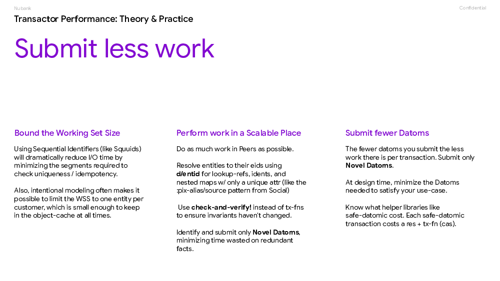

Next, a different technique is performing as much work as you can in a scalable place. This means resolving entity IDs not in the transactor but inside of the Peer. And if you know that nothing about that is changing, you can use a strategy that we call "check and verify." I don't think that we have any public docs on this yet, but you can make a calculation in the Peer to assert an answer and then verify that the basis of which you made that decision hasn't been invalidated inside of the transactor with a transaction function. You can do that instead of running the long checking process to decide what to do inside the transactor as a transaction function.

And lastly, only submit novel datoms. This is a great way to minimize time wasted duplicating redundant facts. 

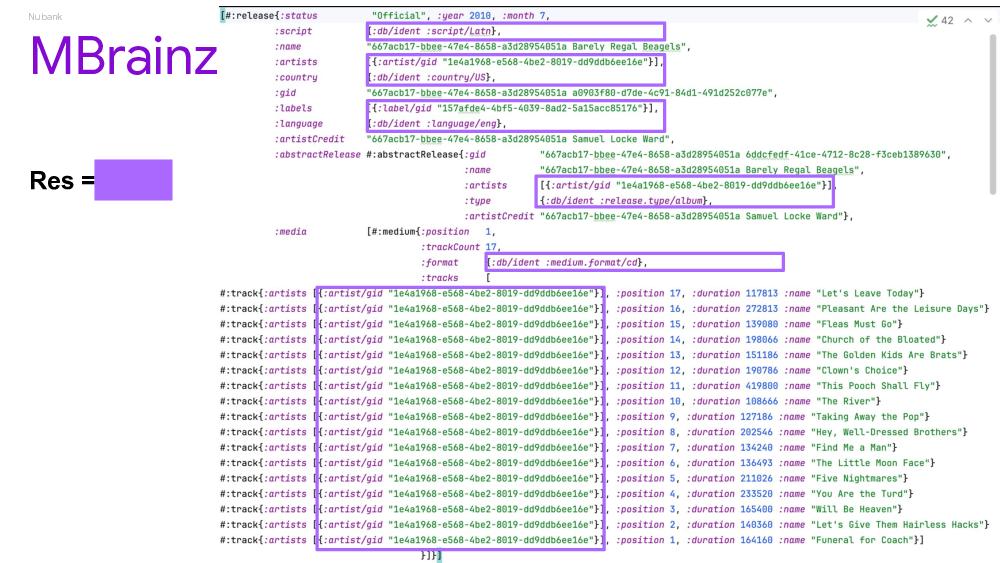

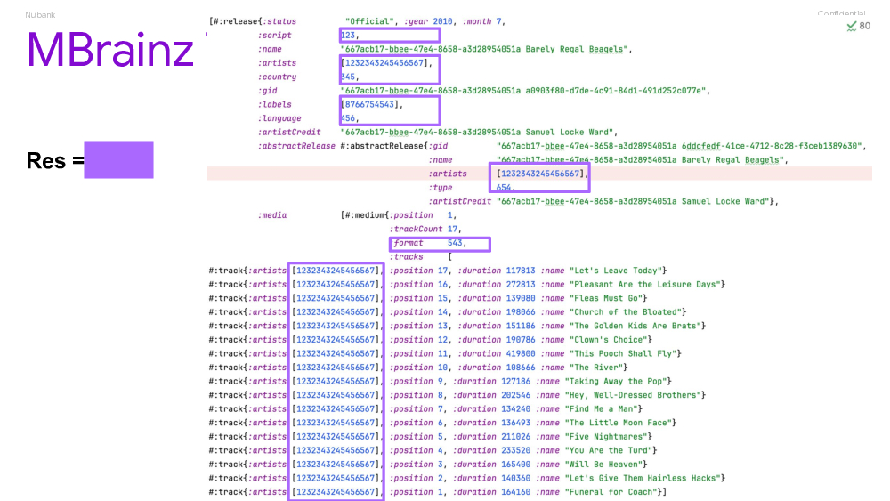

So simply switching this to this: you just resolve these nested maps to their entity identifiers. 

And lastly, again, submit fewer datoms. The best time to figure this out is at design time. And I repeat: try to avoid an upsert-style pattern where you're going to read an entity as a map, mutate some stuff, and submit the whole map again if you're trying to ensure minimal page traffic and IO time when you're submitting your transactions.

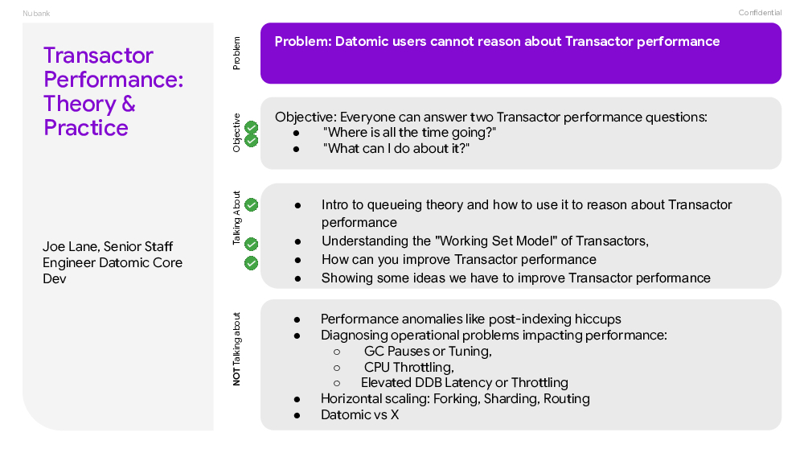

So that was a lot. I'd like now to just wrap up with a few things that we've done recently to improve transactor performance. And I'm kind of excited about it.

[missing slide: Working Set Model paper again]

I want to go back to this Working Set Model paper for a second and just highlight this little section.

On the first page it says,

>For this reason we assume that the operating system must determine on its own the behavior of programs it runs. It cannot count on outside help. Two commonly proposed sources of externally supplied help are the user and the compiler and we claim neither is adequate.

I don't mean to pick on this paper – they're talking about CPUs in a time-sharing operating system, so it makes sense – but when I read this paper, I wanted to challenge this because I didn't really believe the claims or the basis for why they were making this.

[missing slide: "No Prefetch"]

So let's rewind a year. This is a different view of how you could think about the time spent inside of applying a transaction. We got the time queued on the left, the total time inside the transactor. The purple is the IO time which, as we said, in many systems we are bound by the page traffic and IO. And then the actual on-CPU time is the little green slivers. So here we're really just stalling for IO the majority of the time.

[missing slide: "Probe prefetch - 1.10.7180"]

In version `1.0.7180` we released a feature internally called "probe prefetch." I'm not going to get into the details of it right now, but what it will allow you to do is, without any change to your application, we can begin to pre-fetch some of the reads concurrently inside of a single transaction. This is not affecting correctness; we're not interested in [Spectre](https://en.wikipedia.org/wiki/Spectre_(security_vulnerability))-like bugs, so none of this is actually affecting the result. It's purely for side effects to pre-populate the cache with the appropriate data – and it can, because all that data is immutable.

[missing slide: "Hints, a Scalable Approach"]

Today, I want to talk about a feature that we released two days ago called Datomic Hints. This is a scalable approach to identifying work that needs to be done inside of transactions. It's a more general concept than just the first implementation or sub-feature, which we're calling "segment prefetch" (or "transaction hints").

At a high level, how it works is that in the Peer, we're going to speculate the transaction by running `d/with`, and we're going to move the discovery of the segments that we need for a transaction out to a scalable place. We're then going to convey these hints in a manifest under a key called `:hints`, which is just an opaque object. We're going to convey this alongside the transaction data itself.

And then when we're sitting inside of the transactor, when transactions are queued, we're going to actually begin performing the IO for a transaction while it's queued because we know what we need to grab and we can take advantage of that otherwise-wasted time actually performing the IO. This means that we're reducing the IO inside of the `Apply Thread`, which is the critical section, and our utilization can reduce dramatically, thus increasing throughput.

[missing slide: "Segment Prefetch - 1.0.7260, Part of Datomic Hints"]

This is what it looks like. We've got transactions queued inside the transactor and we're fanning out the IO, which again means that most of the time spent actually applying the transaction is just on-CPU time, which is nice and fast.

An interesting consequence of this that I don't quite understand yet is that as the utilization increases, we end up getting more time waiting in the queue, which then gives us more time to prefetch the IO, which then reduces the utilization. So it feels a little dynamic in the sense that the harder we push transactions through the system, the more time we have to actually begin prefetching the IO. It's something I've still got to figure out but I think it's an interesting idea.

[missing slide: "Lifecycle of a transaction"]

[missing slide: "Transaction Lifecycle With Hints"]

So if we go back to the lifecycle of a transaction, this is what we used to have and this is what we have today. The new things are in green or blue, light blue. In the Peers, we're going to run `d/with`. We then have some threads inside the transactor that are running this prefetch operation, which is just pre-populating the data into the object cache.

And then the `d/with` from the Peer sends a manifest over, we just pre-populate it, and again, all the segments are discovered while waiting in the transaction queue. And this can be done even within the transactor. If you need more prefetching capability, you can turn a knob to increase it and you can add more CPU cores to get more capability.

Previously, your transaction was just `d/transact`. If you look at the bottom left, it is now calling `with` and then taking this result from with – which has a hints object – and just passing it as an argument to `transact`. We plan to add (ideally) other optimizations in the future. It's kind of a research area now because I don't know of any other database that can do this – or at least, I think only immutable databases can do this, which is a very interesting idea. I can think of many more optimizations you might want to do or be able to do now in a scalable way.

And with that, I think we've run through our agenda. I don't think we have time for questions, so thank you.
