# Immutable Knowledge Databases

* **Speakers: Darlei Soares and João Nascimento**
* **Conference: [Clojure/Conj 2025](https://www.2025.clojure-conj.org/)**
* **Date: 13 November 2025**
* **Video: [https://www.youtube.com/watch?v=1vBm9XvS5QI](https://www.youtube.com/watch?v=1vBm9XvS5QI)**

[Darlei] 
[00:00:03]
I'm here today to talk about immutable knowledge databases. Essentially like I'm not going to spoil, but it's about Datomic a little bit.

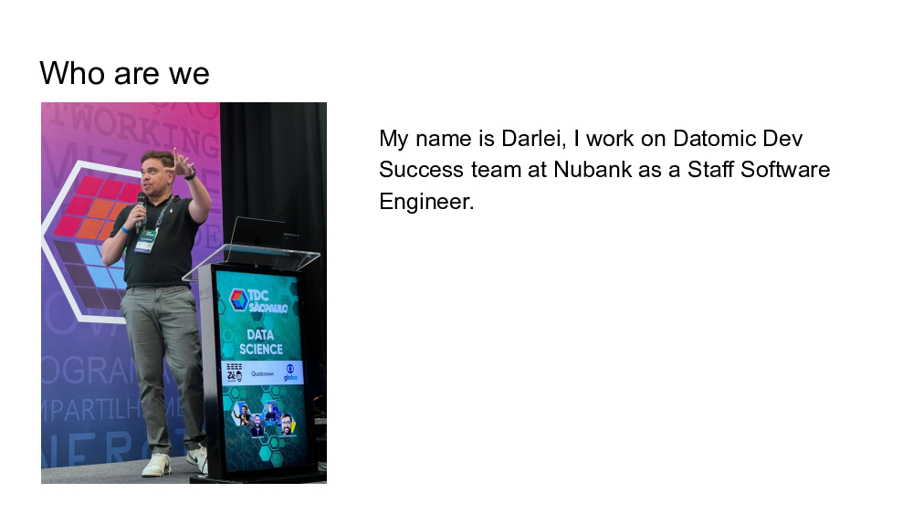

So who am I? My name is Darlei. I work at Nubank as an engineer. I'm on the Datomic dev success team. 

Right next to me is João, he also works at Nubank, works on a different team, it's called SIMPLE. This is João, I know he's goofy. Daughter's really proud daddy.

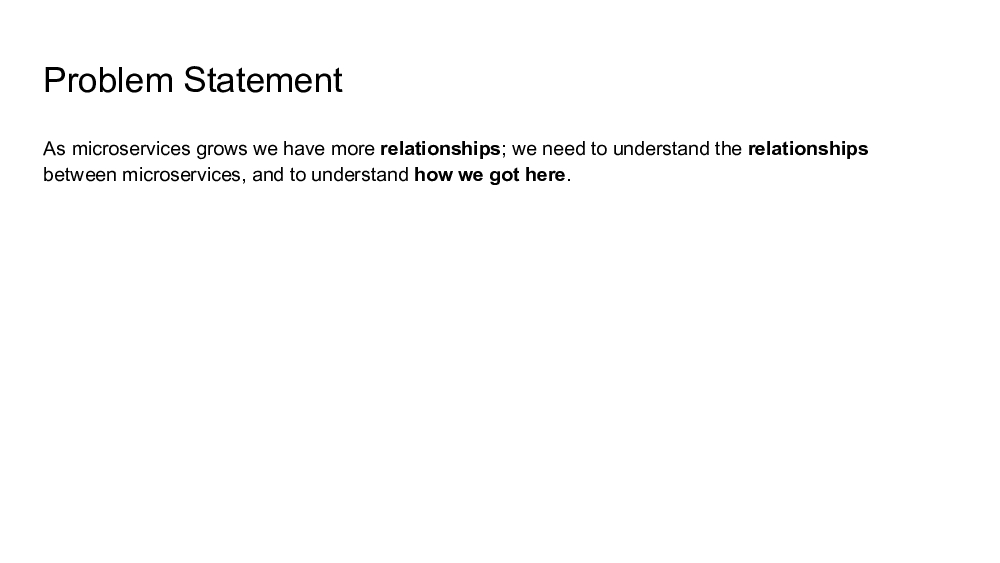

[00:00:46] So since we are here at a Clojure conference, we always start with a problem statement. So essentially, microservices: Nubank has a lot. They grow. They have relationships between microservices. We want to understand how we got here, how they relate to each other, all those things. So essentially that's the problem. We don't know like how microservices talk to each other, identify things, and that's the problem that we have.

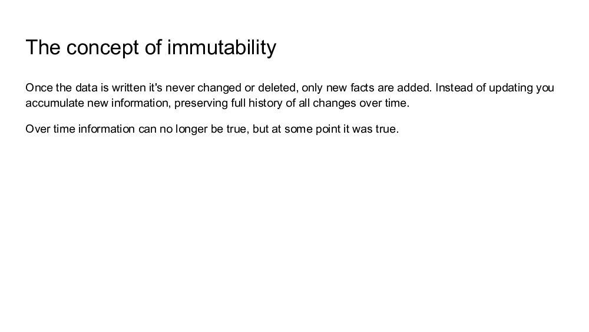

[00:01:19] Before talking about that, I'm going to talk a little bit about immutability. Even though this is Clojure -- everybody here knows the value of it. But for those don't know, think about git, where you have something and you just add new facts. You don't change the past. You can go to the past, but that's a new fact. So think about it like that. I think it's easier to understand. I know all of you are here know this way better than me. 

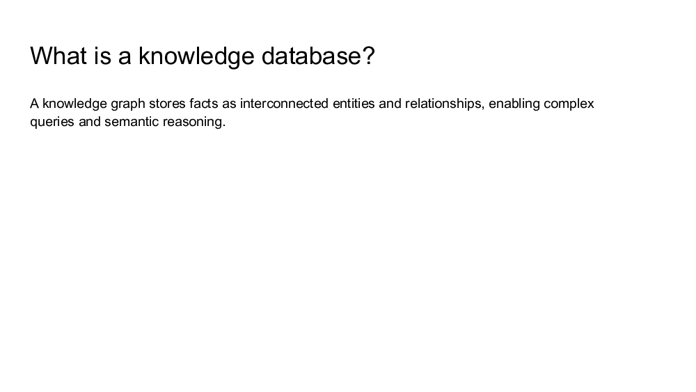

The next thing is, what is a knowledge database? Essentially graphs, entities talking to each other. They relate to each other. And you have value on those relationships. Essentially that's the very easy way to understand this. You can search more, learn more about it.

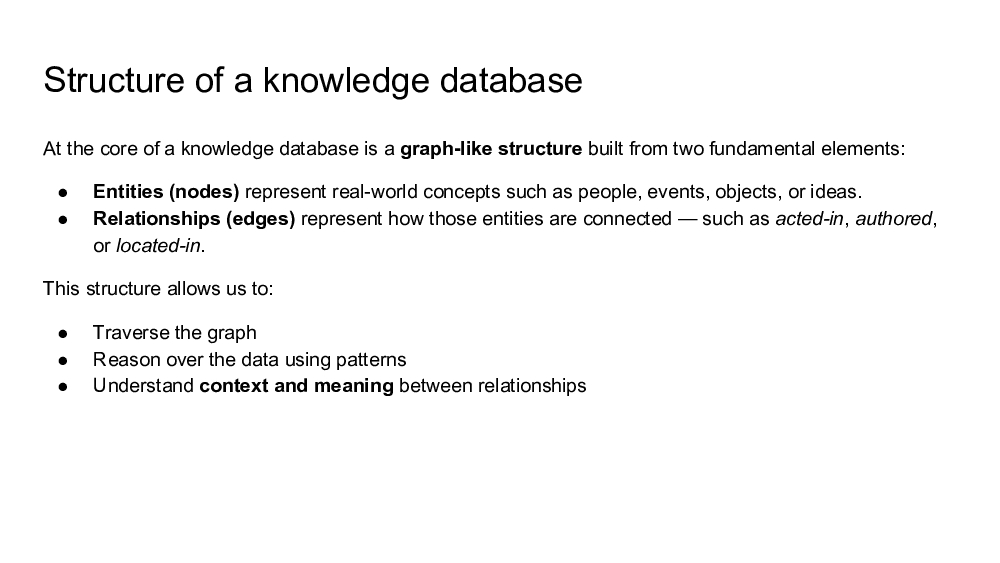

[00:02:53] So as I was saying, the structure of a knowledge database: they have this called entities, also called nodes. And we have relationships that are also called edges. So those nodes, they talk to each other through edges. One example of that is, I like Keanu Reeves, the actor. So he worked on a movie called Matrix. I don't know if you watch it, if you didn't I recommend you to watch it. So Keanu is an entity, Matrix is another. So Keanu worked on Matrix. "Working on" is the relationship between those two nodes. That's how I like to think it. That's the simple way to think about it. 

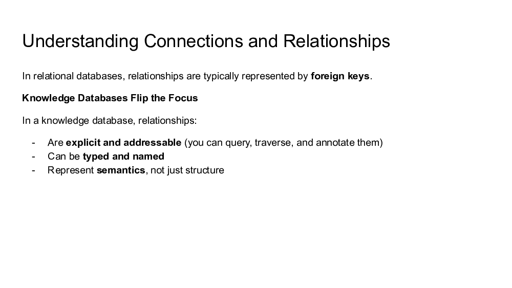

So we can understand these connections, these relationships between those entities. When they started, sometimes they have "worked on" like I said, they have a notation to know what kind of relationship they have. Sometimes they don't need this kind of relationship; they just relate to each other. Datomic is really great for that. Datomic has refs. It's a really good tool for designing this kind of thing.

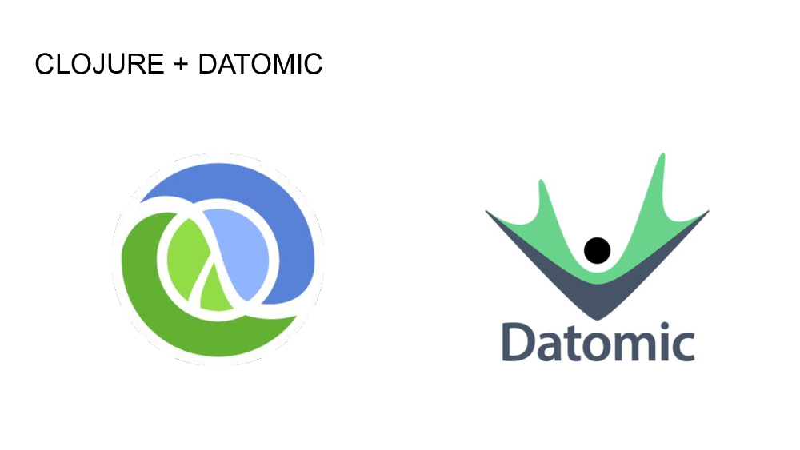

Like I said, João is going to present something that we did at Nubank, mainly using Clojure and Datomic, and that's why he's here.

[João]
Thank you, Darlei. After this masterclass from Darlei about immutable knowledge databases, let's apply how we can use this. 

Well, every microservice needs to communicate with each other, so we have some sort of relation. Can be like in this one: We have Anakin calls Frodo and Frodo calls Mordor, and we can express this with data. Since in Clojure, we treat everything as data. This is a very simple version on how we store in Nubank our relationships between services. But the idea here is to prove that we can express these relations and communications as data, as facts, in Datomic. So if you have any change, we're going to transact this change in this database. (All these slides are going to be available. We have a bunch of links here, so don't freak out.)

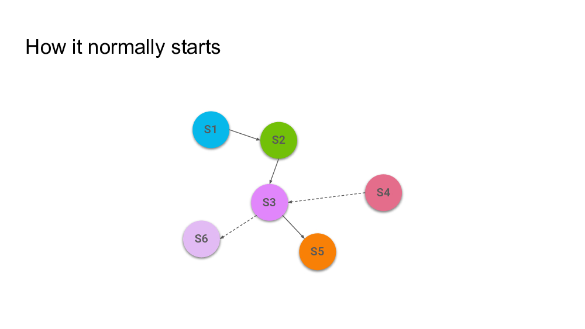

[00:04:25] But how it really started: Why microservices is a problem. So we have a very short, very small number of microservices communicating with each other. At this moment everybody in the room has the same theory of the system. You can draw easily on the board and you don't need any special tool here. 

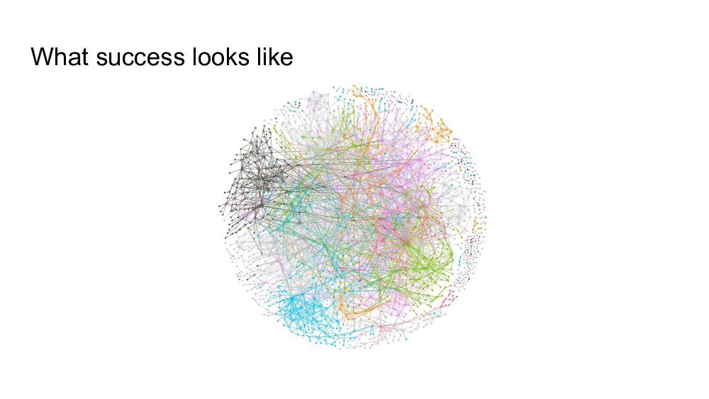

But success comes and the success has a price. You have a hypergrowth. You have new team members. Your services change ownerships and you start to have more complexity. So how can we measure a change? I'm going to change these microservices. Who am I going to impact and how am I going to impact? Complexity is present, and if you don't manage this complexity, it's going to create an inability on how you can move forward.

So it's very usual we have discussions about using C4, for example. In these discussions you see questions like: How coupled are these two services? "Oh, we need to have a loosely couple architecture." These discussions, it's really hard to have a number when we have this type of questions because we have a perception, but how coupled are they really?

So in our findings we are comparing with electronics. I don't know whoever worked with electronics, but we have a multimeter so we can look live: How is the current, the voltage, the things happening in the electronics? And we are asking: Why you don't have something like it to give to engineers?

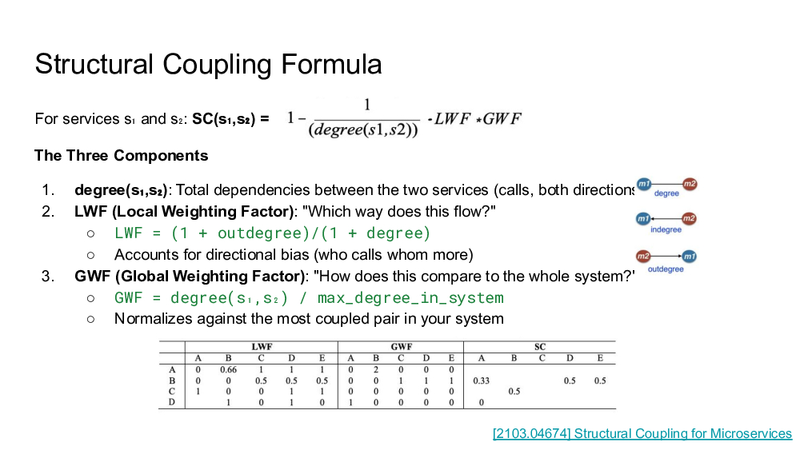

So we find this formula about structural coupling. Don't try to understand right now, but assume that it's going to give a number from zero to one for a given relation between two services. (The order of the parameters matters here.) So we know how coupled they are in a given graph, and what we can do with this? 

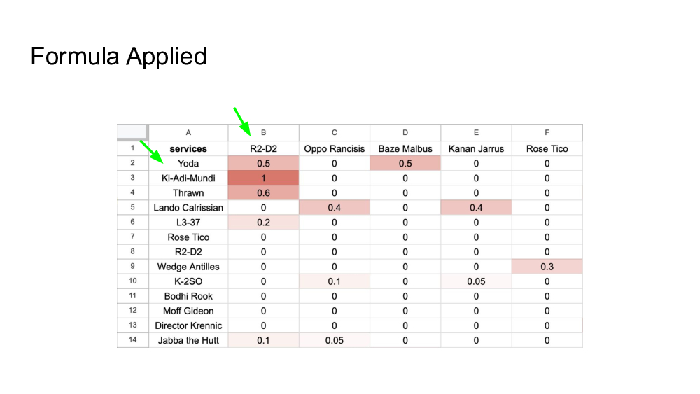

Spreadsheets, always a spreadsheet. So as you can see here we have some dependencies between some characters from Star Wars. They are made on purpose to not make sense because in hypergrowth things start to not make sense. One thing that calls attention here is that the columns are ordered for systems that have more dependency on the graph, and the rows are the systems that create more dependency. So we have Yoda being the service who create more dependency on this graph. R2-D2 is the service who has more dependency. So R2-D2 is a service that could have more crashes, more exchanges on this graph. 

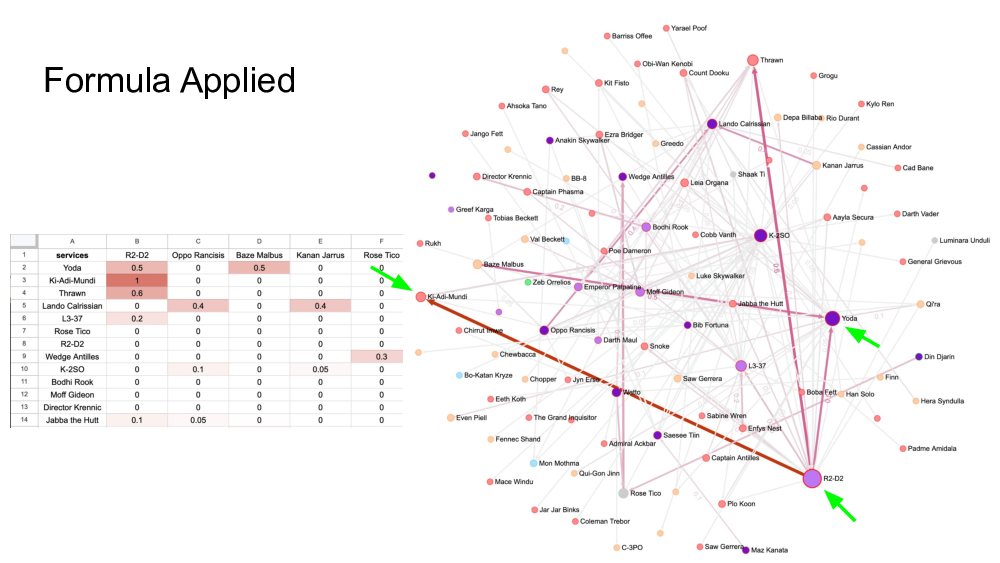

But since we have ClojureScript, we have powers. We needed to discuss this with non-engineer people too. So we decided to create a graph. Here the nodes are the services. The arrow always points to the services who has more dependency on. The thicker and the redder the red gets, it's how much coupled these two services are. So we have, if I can see here, R2-D2 is a system who have more dependency, and -- I should choose a better name to call. I created this presentation; I should choose a very easy name to spell here -- but Ki-Adi-Mundi creates a very strong relationship. When we show this to the team they say: No, they never should be too coupled. But look at the data: these services are almost live for them together. The intention was not the reality that they are facing. So we elevate the discussion at this moment. We have another service here, Yoda. And this Yoda service moved, changed the ownership of the teams, and the team was not aware how dependent on other services they are. 

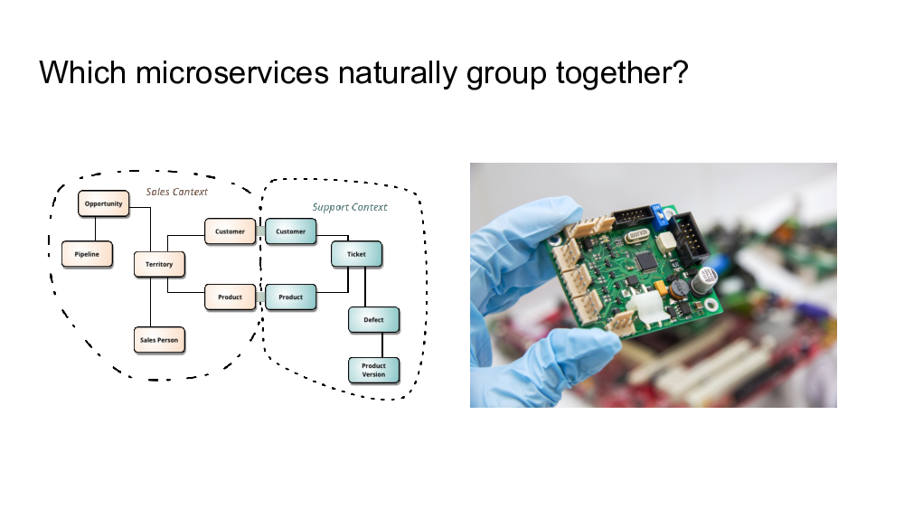

This is good, but it's not enough. How many of you have discussions about domain? We should map our services, our domain, but how you define domains? I don't want to enter the discussion. Comparing to electronics again: every component on this PCB needs to have restrictions and limitations. Physical, or how you going to put the wires in the PCB so you have strict limitations. Even if you try to put the pins on the boards and in the borders, you need to follow some conventions. Since we have the structural coupling metric, what could happen if we compose this and try to find communities on it? 

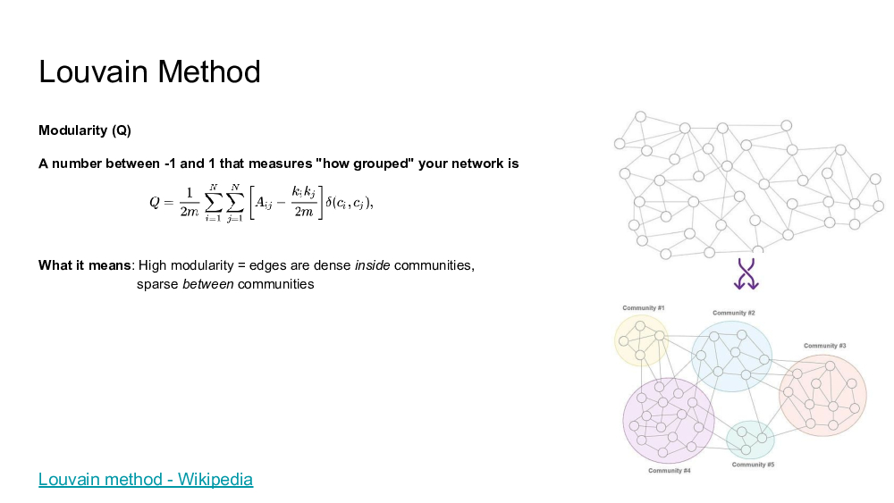

So we found this Louvain Method. Since we have a graph already and we composed with the structural coupling and tried to compare with the actual system, we have another spreadsheet.

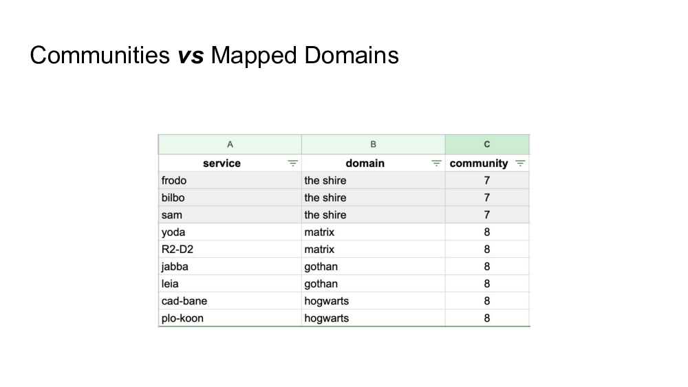

One thing here is that we just changed the name of the services, but it tries to reflect the reality. We saw that some domains are really coupled and they are right, but some complex domains are getting bigger and not smaller. Anytime you are getting bigger—more services or more business capabilities—the bigger this group start to get. So it's a very different discussion. It's not a silver bullet, but we saw then we got this data to the teams. We elevate the discussion, and the discussion is not about more guessing. 

Complexity doesn't happen overnight. Many teams ask: Can I compare the beginning of the year and now? Why not? Datomic has an API `as-of`, so we can. This is a simple code to example it, and you just can compare our coupling: how we were in the beginning of the year without making any change in our application. It's just the input of our functions.

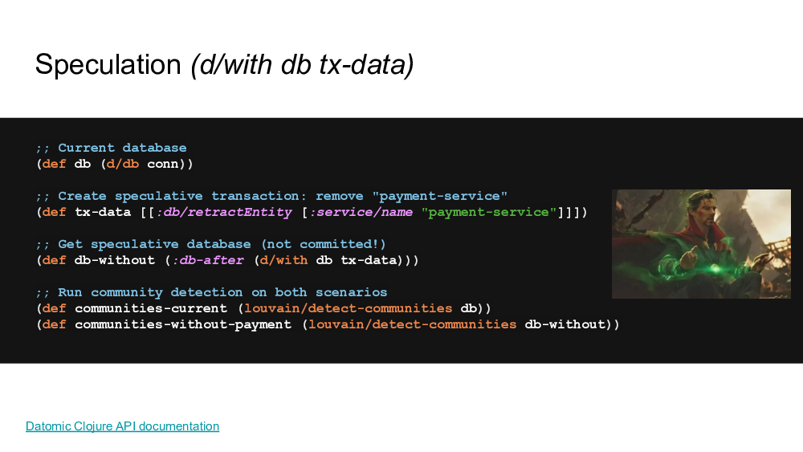

Speculation. People start to say: Okay, at that given moment what would happen if I change or remove the service? Can I do this speculation? Datomic gives this to us with `d/with`, where we just have a database value in-memory where you can transact data, and it's going to be just values. So we can speculate over this database. It's much like the Destiny Doctor—I think that's the name of the actor from the Avengers.

And you could ask: Okay, you did this with a system that was running in production. How crazy are you guys? Since this is a graph analysis and Datomic was done for it because we can scale it, so our peers on this tool that we created was running only for the tool, not impacting the actual system on production. So it's much like two inquiry.

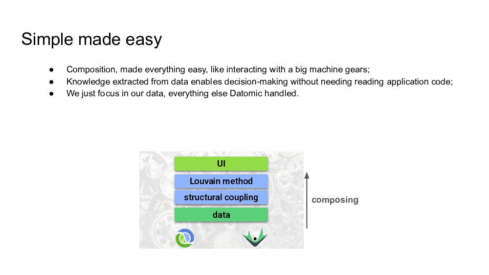

[00:11:17] Well, this story is about composition, how easy things get done. We just compose our data as facts in Datomic. So we compose this data with structural coupling. We added the Louvain method, and we added the UI over it. It enabled us to have knowledge over our entire microservices relationships. It was very simple. It's like interacting with a big machine, where just using some gears, and we leave all the heavy lifting for Datomic and Clojure.

